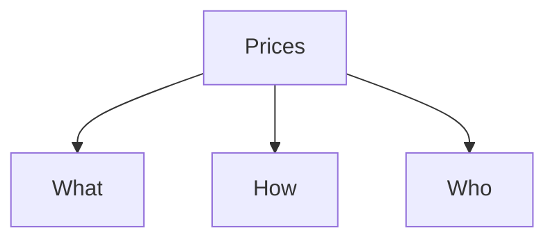

# Introduction


The word economy comes from the Greek word for “one who manages a household.” At first, this origin might seem peculiar. But, in fact, households and
economies have much in common.
A household faces many decisions. It must decide which members of the
household do which tasks and what each member gets in return: Who cooks dinner? Who does the laundry? Who gets the extra dessert at dinner? Who gets to
choose what TV show to watch? In short, the household must allocate its scarce resources among its various members, taking into account each member’s abilities,
efforts, and desires.


Economics may have a reputation as a dismal science, but in fact it addresses some of the most fundamental problems we face: How to make the best decision given that resources are limited. You can use the tools of microeconomics to decide how best to spend your income; how best to divide your time among leisure activities; or how many people to hire in the business you run. Life is full of choices. Microeconomics can help you decide how to make them.


## What is microeconomics?
Microeconomics is about constrained optimization.
It's about how individuals and firms assess
the trade offs they face in making themselves as well
off as possible, subject to the constraints
that they have in terms of their resources.
That is, economics is all about trade offs.
It's all about how can I get the most of my resources,
given the limits those resources place on me?
Now this is why economics is called,
in popular parlance, the dismal science,
because we're always negative.
We're always about the trade offs.
We're always about well, yeah you want that.
But you can't have that.
Have you thought about this, et cetera?
So that's why we're called the dismal science.
So basically the role of economists in society
is to recognize those trade offs.
- Analogy is strategy mobile phone game
- why do people do the things they do? How you can make the most money, and how other people try to make money off you, all within the same framework of constrained optimization.
- Modern Economics was invented at MIT at 1950s

## Plan of the course
- Building a series of models.
- - modeling individual behaviour
- - modeling firm behaviour

```note
Model is any description of the relationship between two or more economic variables.
```

```warning
Economics is quasi-science. Mathematical models rely on assumptions(that not always true) that allow us to describe the real world phenomena with mathematical models. It is almost impossible to mathematically model behaviour of people.
```

- Why we use language of matheamtics to describe the social phenoma, because mathematics is universal and tractable. Think of mathematics as standardized language.

- This inherent flaw, will reveal itself through whole course of microeconomics. On the one hand, we will make assumptions, that we can not prove(though they make common sense), in order to be able to mathematically model wide range of social phenomenas.

- We will use simplified mathematical models, because the simpler the model, the more robust it is to explain the real world.

```note
The mathematical representation of the hapiness of consumer is defined by Utility.
```

- In our modelling we will consider
- - Consumers, that are trying to maximize their utility, subject to their budget constraints.
- - Firms, that are trying to maximize their utility (hapiness a.k.a profit) by selling you the stuff they make, subject to both the demand of consumers.


```note
Modeling producer theory is more complicated than modeling consumer theory, since producers needs to take into account whims of consumers and the cost of the input materials. Whereas, consumers just need to make themself happy, subject to the money they have.
```

## Three fundamental questions of economics

Based simply on the assumptions
that people make themselves as well-off as possible,
subject to budget constraint.
And firms maximize profit, subject to demand
of consumers and input markets.
We're going to answer the three fundamental questions
of economics.

- What goods and services should be produced in society?
- How to produce those goods and services?
- Who gets those goods and services?

And all of these three questions are
going to be answered through one mechanism, which is prices.
We're going to show you how the development of prices
in markets can essentially solve these three
fundamental questions of economics.



### Examples. Public health issue

- Obesity
- - Taxing fatty and sugary foods, subsequently increasing prices.
- - Once that price goes up, people are going to want less of these fatty and sugary foods and more of healthier foods.
- -  The inputs into foods that are fatty are going to be less attractive, and inputs into foods that are less fatty will be more attractive. So foods will be produced in a way which will contain less fat.
- - If the price of fatty goods goes up, that's not going to matter for a wealthy person, but will matter a lot for poor person.

```warning
In reality, it may be
that high-income consumers are the ones who respond
the most to the price signal. Basically, our assumptions
are going to face limits. But in this kind of simplified framework, we'll be able to answer some basic directional questions.
```


### Theoretical vs Empirical Microeconomics


- Theoretical economics is the process of building models to try to explain economic phenomena
- Empirical economics is the process of testing models to see if they actually do explain economic phenomena and to understand, how changes that theory predicts actually play out in the real world.

If take the example of diabetes, theoretical economics provide the answer how price change will affect the demand for fatty and sugary foods.

Empirical economics would provide answer for how big is that effect?


So theoretical economics is about developing the underlying
understanding of how things work.
Empirical economics is about testing those models
and understand their importance and application the real world.
OK?

```note
Theoretical economics has tension of building models that are complicated enough that they can explain a wide variety of real world phenomena,
but simple enough that you can actually write them down
with relatively few assumptions and relatively simple math.
```


### Positive versus Normative Economics
- Positive economics is the study of the way things are.
- Normative economics is the study of the way things should be.
- - Efficiency is about maximizing the size of the economic pie, producing as many goods and services as possible.
- - Equity is about how you slice up that pie and distribute it.

```note
Example Ebay auction. Water-diamond paradox.
```


## Essense of microeconomics
Maximize your utility, which is determined from your preferences. Subject to your budget constraint, which will be about resources and prices.
