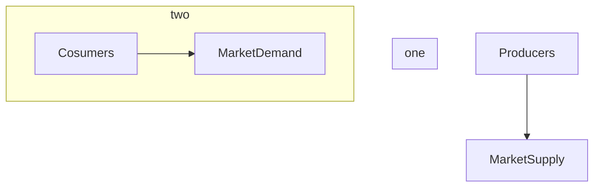

# Supply and Demand

Supply and Demand are two forces in the market that jointly decides what quantity of the good to produce and at which price to sell that good.

## Markets



```note
For now we will assume, that markets are perfectly competetive. It means, that no single seller or buyer could influence the price of good. If one seller increases the price for good, nobody would buy from him and the market price of the good will not change. Example is foreign exchange markets, agricultural markets, internet related markets(Ebay, Amazon) etc.
```

----

## Demand

```note
Law of Demand: Consumers demand more of a good the lower its price.
```

Quantity demanded is the amount of a good or service that buyers are willing and able to buy at a specific price. It is usually negatively related to price.  We call this negative relationship the law of demand. (We will talk about exceptions later, but unless we are discussing those exceptions you should assume that at higher prices, quantity demanded is smaller.)

### Demand for wheat
For example, when wheat prices are low, buyers are willing and able to buy more wheat. When wheat prices are high, buyers are unwilling or unable to buy more wheat. This might be due to each buyer buying less wheat, or due to some buyers ceasing to buy wheat at all and dropping out of the market. Suppose that when wheat costs $2/kg, buyers demand 140 kg/day. Suppose that when wheat costs $4/kg, buyers only demand 20 kg/day.

Let's show this in a demand schedule, with some additional fictitious datapoints:

| Price  ($)  | Quantity Demanded (kg) |
| ------- | -------- |
| 1 | 140 |
| 2 | 100 |
| 3 | 50 |
| 4 | 20 |


### Demand for cofee


----

## Supply

Supply provided is the quantity of the good and services that firms are willing to provide at the given price.


```warning
Although the Law of Demand states that the demand curve slope downward, we
have no “Law of Supply” that requires the market supply curve to have a particular
slope. The market supply curve can be upward sloping, vertical, horizontal, or downward sloping. Many supply curves slope upward, such as the one for coffee. Along
such supply curves, the higher the price, the more firms are willing to sell, holding
costs and government regulations fixed
```

----

## Market Equilibrium

The supply and demand curves determine the price and quantity of goods and services
in a market. The demand curve shows the quantity consumers want to buy at various
prices, and the supply curve shows the quantity firms want to sell at various prices.
Unless the price is set so that consumers want to buy exactly the same amount that
suppliers want to sell, either some buyers cannot buy as much as they want or some
sellers cannot sell as much as they want.

When all traders are able to buy or sell as much as they want, we say that the
market is in **equilibrium**: a situation in which no one wants to change his or her
behavior. The __equilibrium price__ is the price at which consumers can buy as much as
they want and sellers can sell as much as they want. The __equilibrium quantity__ is the
amount that consumers buy and suppliers sell at the equilibrium price

```note
The equilibrium price and quantity are also sometimes called the __market-clearing price__ and quantity. If all the buyers and sellers gathered together in a single marketplace, and buyers purchased as much as they were willing and able to at the equilibrium price, then the each buyer and seller would finish their business and go home for the day. There would be nobody left in the market trying fruitlessly to buy or sell additional goods at that price. Thus, this market is said to have __cleared__.
```


### Schocks to Demand and Supply


### Price floor
Some government policies do more than merely shift the supply or demand curve. For
example, governments may control prices directly, a policy that leads to either excess
supply or excess demand if the price the government sets differs from the equilibrium
price. When the government sets a price floor at $$\underline{p}$$, the price at which goods are sold may not fall below $$\underline{p}$$.


### Price ceiling
When the government sets a price ceiling at $$\bar{p}$$, the price at which
goods are sold may be no higher than $$\bar{p}$$.


- Cost-benefit analysis of people's time worth

```note
We care about excess demand because it is the inefficient outcome, there also allocation problems. But the price ceiling gives us equity.
```

**Question:** Assume that there is the shock either from demand or supply, after the schock happend, could you know, whether quantity of goods sold diminished or increased only by knowing price change?